# Nuget Packages erstellen und veröffentlichen

Ein NuGet-Package ist ein Paketformat (meist eine .nupkg-Datei), das wiederverwendbaren Code für .NET-Projekte enthält. Es ist das zentrale Verteilungssystem für Bibliotheken, Tools und Frameworks in der .NET-Welt.

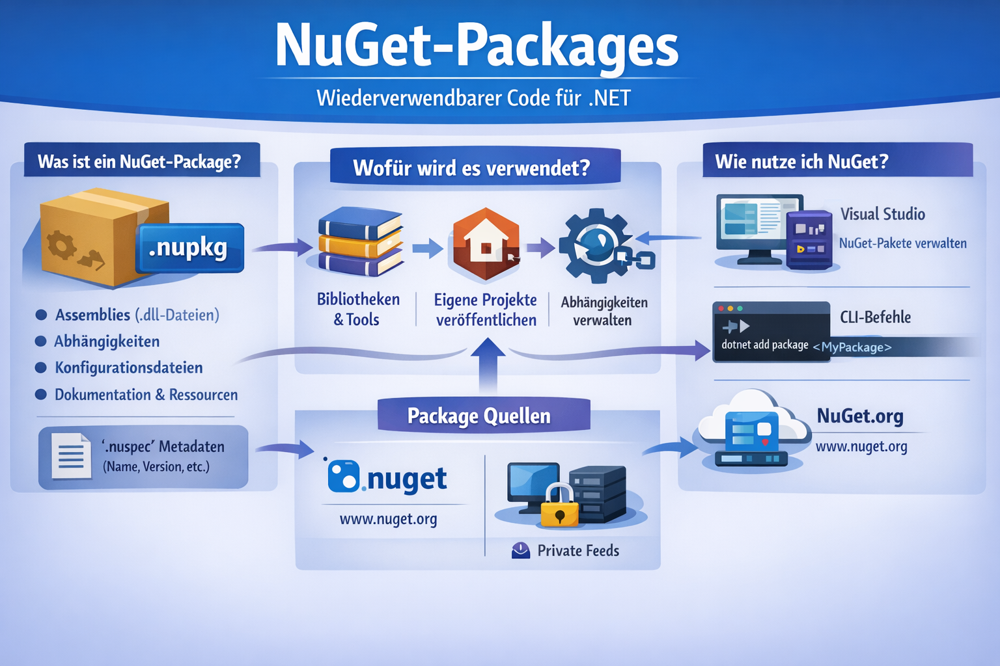

Ein NuGet-Package kann enthalten:

- Assemblies (z. B. .dll-Dateien mit kompiliertem Code)
- Abhängigkeiten (andere Packages, von denen es abhängt)
- Konfigurationsdateien
- Dokumentation, Skripte oder andere Ressourcen
- Eine nuspec-Datei mit Metadaten wie Name, Version, Autor und Beschreibung

NuGet-Packages dienen dazu, Code einfach zu teilen, wiederzuverwenden und zu verwalten.
Typische Anwendungsfälle:

- Hinzufügen von Bibliotheken (z. B. Newtonsoft.Json für JSON-Verarbeitung)
- Veröffentlichen eigener Projekte zur Wiederverwendung in mehreren Anwendungen
- Automatische Verwaltung von Abhängigkeiten (NuGet löst Versionen und Referenzen automatisch auf)

# Inhalt
  1. .NET Projekt File Format & Package Details
  2. Github workflow action
  3. Versionierung & Trigger
  4. Einbindung in eigene Projekte (VS)

## 1 .NET Projekt File Format & Package Details
.NET Projekte können derzeit unterschiedliche Fileformate haben. Wird ein .NET Framework Projekt angelegt, verwendet das VisualStudio das alte XML Projekt Format. Wird hingegen eine .NET Core Version verwendent (zb: .NET 8.0 LTS) legt VisualStudio das Projekte im sogenannten SDK Style an. Dieses Format ist die aktuellere Version und bringt einige Vorteile mit sich:

- vereinfachte Projektdatei
- bessere Versionskontrolle (Git etc.)
- einfache Verwaltung von Abhängigkeiten
- Multi-Targeting Unterstützung
- schnellere Build-Performance
- einfache Migration und Erweiterbarkeit
- automatische Imports
- plattformübergreifende Entwicklung

Der Grundaufbau von SDK-Style Projektdateien sieht wie folgt aus:

```Xml
<Project Sdk="Microsoft.NET.Sdk">
  <PropertyGroup>
    <TargetFramework>net8.0</TargetFramework>
  </PropertyGroup>
</Project>
```

**Übersicht:**

| Kategorie              | Alter Stil (.NET Framework) | Neuer SDK-Stil (.NET Core / .NET 5+) |
| ---------------------- | --------------------------- | ------------------------------------ |
| Projektdatei           | Lang & redundant            | Kurz & automatisch                   |
| Paketverwaltung        | `packages.config`           | `PackageReference`                   |
| Multi-Targeting        | Umständlich                 | Einfach (`TargetFrameworks`)         |
| Build-System           | Älter & langsamer           | Moderner MSBuild                     |
| Plattformunterstützung | Nur Windows                 | Cross-Platform                       |
| Versionskontrolle      | Viele Konflikte             | Weniger Konflikte                    |

Basierend auf dem neuen SDK-Style Projektfile Format kann über Visual Studio auch die Package Konfiguration vorgenommen werden. Diese beinhaltet Meta Daten wie Autor, Bezeichung usw. für das Nuget Package. 
Dazu einfach im Visual Studio im Solution Explorer auf das Projekt gehen, rechte Maustaste die `Properties` auswählen. Es öffnet sich die View mit den Projekt-Eigenschaften:

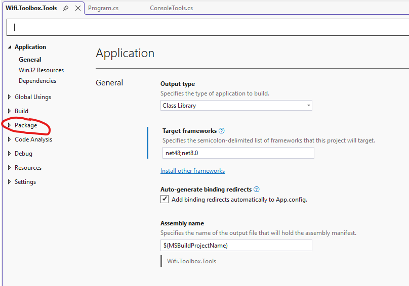

Mit einem Klick auf das Tab `Package` sind die Nuget-Package Einstellungen sichtbar:

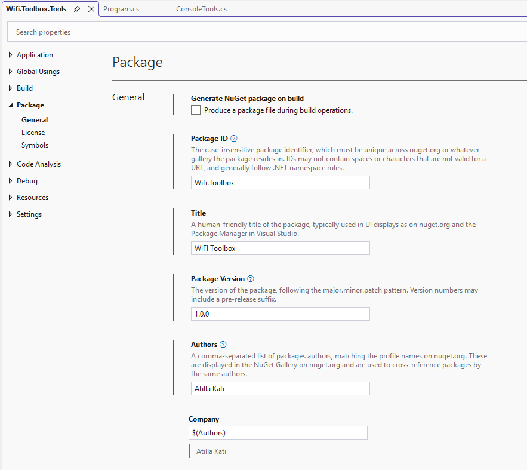

Das Projekt File kann auch direkt im XML Editor bearbeitet werden (meine bevorzugte Variante). Dazu im `Solution-Explorer` mit der rechten Maustaste auf das Projekt klicken (Kontextmenü) und `Edit Project File` auswählen:

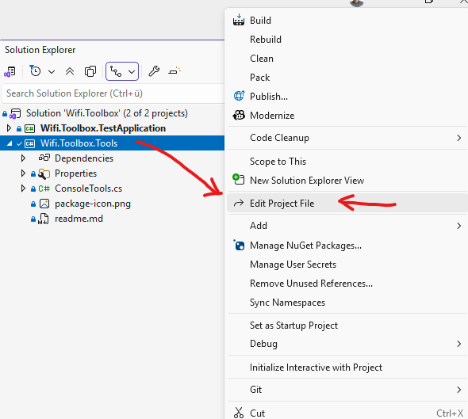

Hier können nun Meta-Daten für das Nuget-Package definiert werden. Der Block unten kann einfach kopiert werden. Folgende Daten haben wir für unsere Wifi.Toolbox definiert:

```Xml
		<!-- NuGet package metadata -->
		<GeneratePackageOnBuild>False</GeneratePackageOnBuild>
		<Title>WIFI Toolbox</Title>
		<PackageId>Wifi.Toolbox</PackageId>
		<Version>1.0.0</Version>     <!-- Die Version ist nicht relevant, da diese über Tags gesetzt wird -->
		<Authors>Your Name</Authors> <!-- Dein Name als Autor -->
		<Description>The Wifi.Toolbox.Tools contains our basic methods, which we wrote during the course and which are very helpful 
			for implementing applications in the console. Each student is required to maintain this package independently. The necessary 
			infrastructure will be prepared in class.
            The following methods are included in the package:
            - Reading in numerical values
            - Methods for designing console interfaces</Description>
		<PackageTags>utilities;framework48;framework8</PackageTags>
		<PackageLicenseExpression>MIT</PackageLicenseExpression>
		<PackageIcon>package-icon.png</PackageIcon>
		<PackageReadmeFile>readme.md</PackageReadmeFile>

        <!-- Hier bitte den Link auf dein Repository-Ordner eintragen -->
        <RepositoryUrl>https://github.com/atillakati/sw_developer_2025_atilla/tree/develop/20251211/Wifi.Toolbox</RepositoryUrl>
        <PackageProjectUrl>https://github.com/atillakati/sw_developer_2025_atilla/tree/develop/20251211/Wifi.Toolbox</PackageProjectUrl>
```

Damit unser Toolbox-Nuget in unterschiedlichen .NET Projekten eingesetzt werden kann, müssen wir die unterstützten .NET Versionen im Projekt angeben. Dazu muss im Feld `Target frameworks` folgendes eingetragen werden:

```Xml
<TargetFrameworks>net48;net8.0</TargetFrameworks>
```
Dies kann direkt im Projekt-File oder aber auch über die VisualStudio Oberfläche erfolgen.

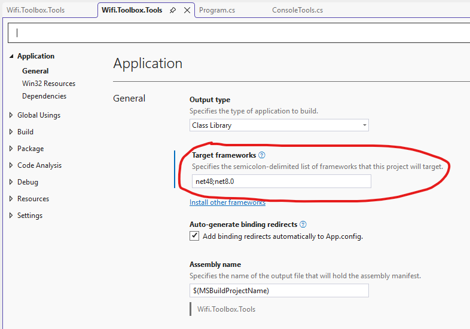

## 2. Github workflow action
Über die `Github Actions` erreichen wir eine Automatisierung zur Erstellung und Veröffentlichung unseres Packages. Ohne diese Automatisierung müssten wir jedes mal für eine neue Version das Package manuell compilieren, packen und publishen.

`GitHub Actions` ist ein integriertes Automatisierungssystem innerhalb von GitHub, mit dem du Workflows erstellen kannst, die automatisch auf Ereignisse in deinem Repository reagieren.
Diese Workflows werden in YAML-Dateien beschrieben und laufen in sogenannten GitHub-Runners (virtuellen Maschinen oder Containern).

Damit kannst du:
- Code automatisch testen, bauen und bereitstellen (CI/CD)
- Linting, Code-Qualitätsprüfungen oder Security-Checks durchführen
- Releases, Versionierungen oder Package-Deployments automatisieren
- Individuelle DevOps-Prozesse direkt in GitHub steuern

> Hauptidee: GitHub Actions = Automatisierung direkt in deinem Repository.

- Einsteigerfreundliches Tutorial mit praktischen Beispielen zum Erstellen eines Workflows:
[FreeCodeCamp: Learn to Use GitHub Actions – Step-by-Step Guide](https://www.freecodecamp.org/news/learn-to-use-github-actions-step-by-step-guide)
- Quickstart – Einstieg in GitHub Actions: [Schnellstart für Github Actions](https://docs.github.com/de/actions/get-started/quickstart)

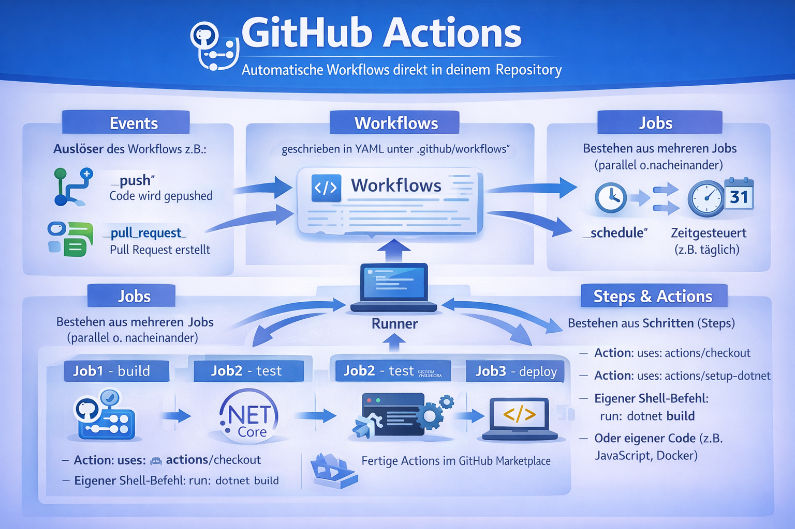

### Steps für unser Nuget
1. Erstelle in deinem Repository im Root-Folder folgenden Ordner: `.github`
2. Dann erstellst du in diesem Ordner einen weiteren Ordner mit der Bezeichnung: `workflows`
3. In diesem workflows Ordner erstelle nun eine Datei mit dem Namen: `publish.yml`
4. In diese Datei kopierst du nun folgenden Zeilen:

```Yaml
name: Publish NuGet Package

on:
  push:    
    tags:
      - '*.*.*'   # optional: only run on version tags like v1.0.0

permissions:
  contents: read
  packages: write   # this is the important one

jobs:
  publish:
    runs-on: ubuntu-latest

    steps:
      - name: Checkout code
        uses: actions/checkout@v4

      - name: Setup .NET
        uses: actions/setup-dotnet@v4
        with: 
          dotnet-version: '8.0.x' # or 6.0.x / 7.0.x / 4.8 SDK depending on your project

      - name: Restore dependencies
        run: dotnet restore 20251211/Wifi.Toolbox/Wifi.Toolbox.Tools/Wifi.Toolbox.Tools.csproj

      - name: Build
        run: dotnet build 20251211/Wifi.Toolbox/Wifi.Toolbox.Tools/Wifi.Toolbox.Tools.csproj --configuration Release --no-restore

      - name: Pack NuGet package
        run: dotnet pack 20251211/Wifi.Toolbox/Wifi.Toolbox.Tools/Wifi.Toolbox.Tools.csproj --configuration Release -p:PackageVersion=${GITHUB_REF_NAME} --no-build -o ./artifacts

      # --- Publish to GitHub Packages ---
      - name: Publish to GitHub Packages
        run: dotnet nuget push "./artifacts/*.nupkg" --source "https://nuget.pkg.github.com/${{ github.repository_owner }}/index.json" --api-key ${{ secrets.GITHUB_TOKEN }} --skip-duplicate
```

> Stell sicher, dass der eingetragene Pfad zum Projektfile (.csproj) richtig ist.

Alle Änderungen aus diesem Schritt müssen sich schlussendlich im `develop` Branch befinden. Bitte Änderungen committen und pushen. Falls du einen eigenen Feature-Branch verwendet hast, diesen Branch nun mit deinen Änderungen abschliessen. 


## 3. Versionierung & Trigger
Ich kann empfehlen, dass sämtliche zukünftigen Code-Änderungen für das Nuget Package, in einem eigens dafür angelegten Branch durchgeführt werden sollten. Im Unterricht haben wir dafür gemeinsam einen feature-Branch mit der Bezeichnung `ConsoleTools-Package` angelegt. So bleiben deine Änderungen übersichtlich und wartbar. Dieser feature-Branch muss nie abgeschlossen werden - d.h. Änderungen in diesem Branch einfach comitten, Tag hinzufügen und dann pushen.

Wie im obigen .yml File zu sehen ist, wird der ganze Workflow durch einen Push eines Tags getriggert. d.h. Wenn du einen Stand in deinem Branch hast, welches nun als neue Nuget Version publiziert werden soll, kann der Workflow wie folgt gestartet werden:

- Einen Tag im Format `*.*.*` dem Branch hinzufügen (New Tag)
  
  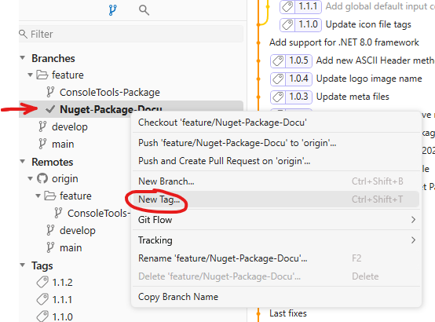
- Tag erstellen und pushen

Sobald der Tag gepusht ist, kann auf github.com im Repository unter `Actions` der Workflow überwacht werden. Der Screen zeigt die Trigger-Version (zB: 1.1.2) und die letzte Commit Beschreibung:

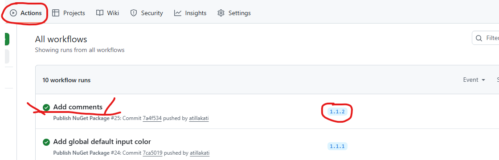

Wenn die gesamte Konfiguration korrekt durchgeführt worden ist und das Projekt sich auch kompilieren lässt, sollte nun der Workflow erfolgreich (grüner Hacken) ausgeführt werden. Falls diese nicht der Fall ist, kannst du im Workflow (drauf klicken) die genaue Fehlermeldung einsehen. Um den Fehler dann zu beheben => Fehlermeldung recherchieren...

## Einbindung in eigene Projekte (VS)
Damit wir ein Nuget in unseren Projekten verwenden können sind zwei Schritte erforderlich:
   - Zugriff auf das Nuget herstellen
   - Einbindung des Nugets in das Projekt (Installation)

### Zugriff auf das Nuget herstellen

Das Visual Studio greift auf `Nuget-Sources`  zu, aus denen dann die einzelnen verfügbaren Nuget Packete dargestellt und installiert werden können. Für unser Nuget müssen wir nun eine neue Source anlegen, damit der `Nuget Package Manager` auch in dieser Source nach unserem Nuget sucht.

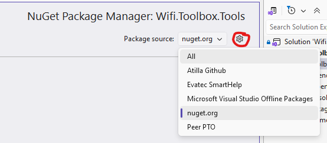

Wenn auf ein Projekt im `Solution-Explorer` mit der rechten Maustaste geklickt wird, ist das Kontextmenü zusehen. Dort befindet sich u.A. der Menüpunt `Manage Nuget-Packages...`. Bitte diesen auswählen - der `Nuget Package Manager` sollte wie oben abgebildet sichtbar sein.

Mit einem Klick auf das Zahnrad öffnest du das `Nuget Package Sources` Einstelldialog. In diesem Dialog solltest du zumindest die Source nuget.org sehen. Hier werden wir, wenn wir alle Infos organisiert haben unsere neue Source für unser Nuget Package anlegen.

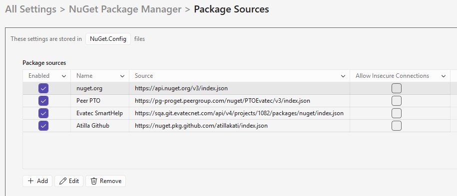

Damit der Package Manager auf unser Nuget zuugfreifen kann, benötigen wir ein github.com-Token. Dazu bitte folgende Schritte durchführen:

- Melde dich auf [Github](https://github.com/) an dein Account an
- Geh auf den Avatar ganz rechts oben und öffne das User-Menü und selektiere `Settings`
- Nun scrolle auf der Seite runter zum letzten Menüpunkt auf der linken Seite,  klicke auf den Menüpunkt `<> Developer settings`
- Selektiere links den Punkt `Personal access tokens` und wähle dann `Tokens (classic)`
- Nun kannst du ein personal Token anlegen. Klick rechts oben auf den Button `Generate new token` und wähle `Generate new token (classic)`
- evtl. musst du dich nun an deinem Account anmelden oder nur verifizieren
- Auf der Seite `New personal access token (classic)` vergebe nun eine Token-Bezeichnung wie zB: `WIFI_Nuget_Access`, weitere Details siehe Abbildung unten:

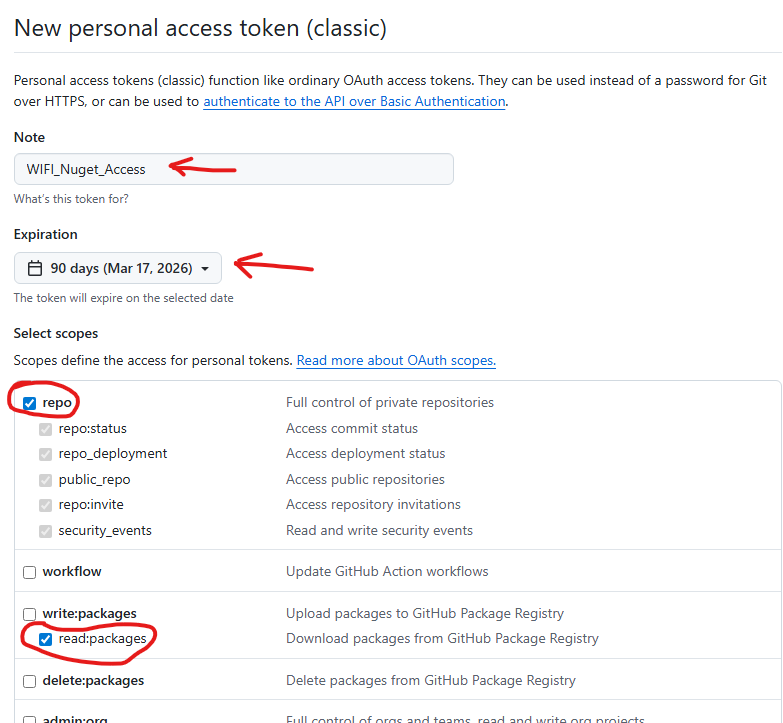

Für `Expiration` sollte eine endliche Dauer (zB: 90 Tage) eingetragen werden. Bitte nicht unbegrenzt auswählen da dann der Token unbegrenzt gültig wäre und diese evtl. ein Risiko darstellen kann.

- Sind alle Felder entsprechend der Abbildung ausgefüllt, den Button `Generate token` ganz unten klicken!
- Nun sollte folgendes Bild sichtbar sein:

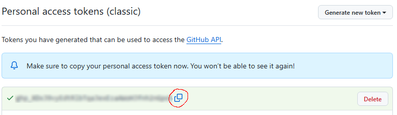

Mit dem oben markierten Copy-Button könnt ihr nun euren Personal access token (=PAT) kopieren. Diesen benötigen wir im nächsten Schritt. 

**Achtung:** Den Token seht ihr hier und jetzt genau einmal, ein nachträgliches Einsehen der Tokens gibt es nicht, also kopieren nicht vergessen und lasst am Besten die Website noch offen!

- Im Visual Studio kann nun die Bearbeitung fortgesetzt werden. Auf dem `Nuget Package Sources` Einstelldialog nun auf den Button `+ Add` klicken!
- Folgende Einstellungen vornehmen:

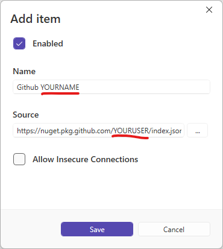

Name:   `Github YOURNAME`
Source: https://nuget.pkg.github.com/YOURUSER/index.json

> Bitte für YOURNAME deinen Namen und für YOURUSER deinen Github Usernamen verwenden!!!!

- Sind die Daten wie oben abgebildet eingetragen, kann der Dialog mit `Save` geschlossen werden. Glückwunsch! Die Source ist nun angelegt.
- Bitte nun wieder den Nuget Package Manager öffnen


- Unter Source sollte nun eure neue Source zu finden sein - bitte diesen auswählen! Sobald diese Source zum ersten Mal ausgewählt wird kommt ein Anmeldedialog, über den ihr Visual Studio Zugriff auf eure Pacakge Source geben müsst. Verwendet dazu bitte euren `Github Usernamen` und das `Token` als Passwort. 
- Hat alles geklappt, sollte nun im Tab Browse euer Nuget Package aufgelistet werden:

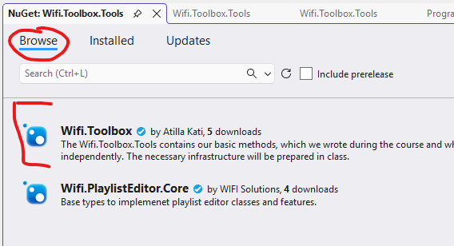

Visual Studio hat nun Zugriff auf euer Repository und kann das Nuget Package auflisten. Somit sind wir bereit für den nächsten Schritt.

### Einbindung des Nugets in das Projekt (Installation)

Um in einem .NET Projekt ein Nuget Package zu verwenden müssen folgende Schritte durchgeführt werden:

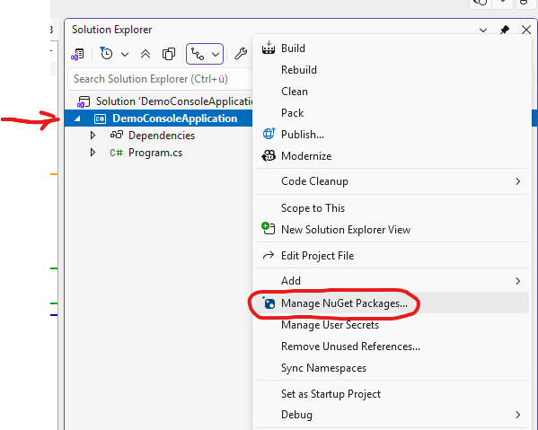
  
- Das Projekt in dem ein Nuget Package verwendet werden soll mit der rechten Maustaste anklicken!
- Über das Kontextmenü den Punkt `Manage NuGet Packages...` auswählen
- Sicherstellen, dass im `NuGet Package Manager` für Package Source die neue Github Source ausgewählt ist
- Das Nuget Package welches verwendet werden soll anklicken und links auf den Button `Install` klicken!

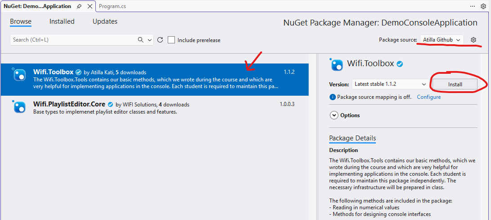

Nun ist das Package im Projekt installiert und du kannst die Typen aus dem Nuget in deinem Projekt verwenden. Vergiss nicht das using hinzuzufügen! Viel Spaß!

```csharp
using System;
using Wifi.Toolbox.Tools;

namespace DemoConsoleApplication
{
    internal class Program
    {
        static void Main(string[] args)
        {
            ConsoleTools.DEFAULT_INPUT_COLOR = ConsoleColor.White;

            ConsoleTools.CreateHeader("Students Management Tool v0.1 (alpha)");
            ConsoleTools.WriteAsciiArtHeader("stu-man-to", ConsoleColor.Yellow);

            int alter = ConsoleTools.GetInt("Bitte Alter eingeben: ", 10, 110);

            DateTime birthyear = DateTime.Now.Year - alter;
            ConsoleTools.WriteColoredMessage($"Sie wurden im Jahr {birthyear} geboren.", ConsoleColor.Cyan); }
    }
}
```
